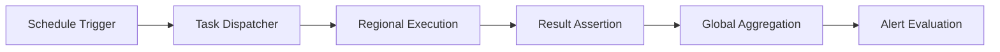
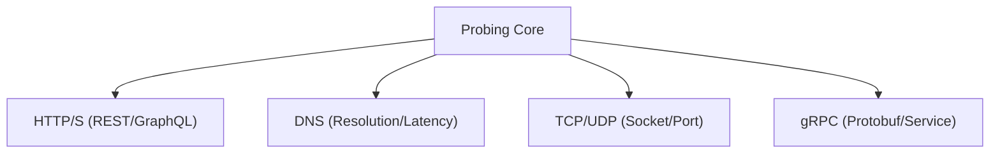
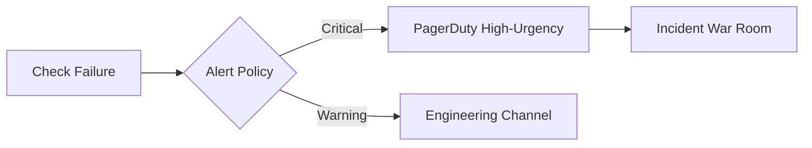
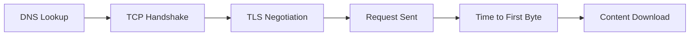
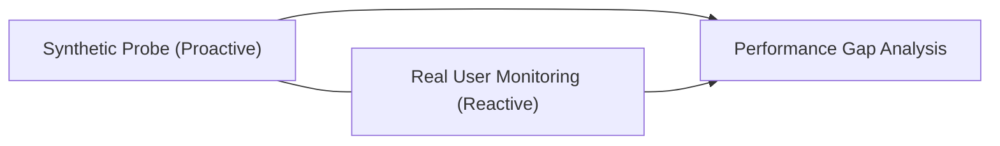
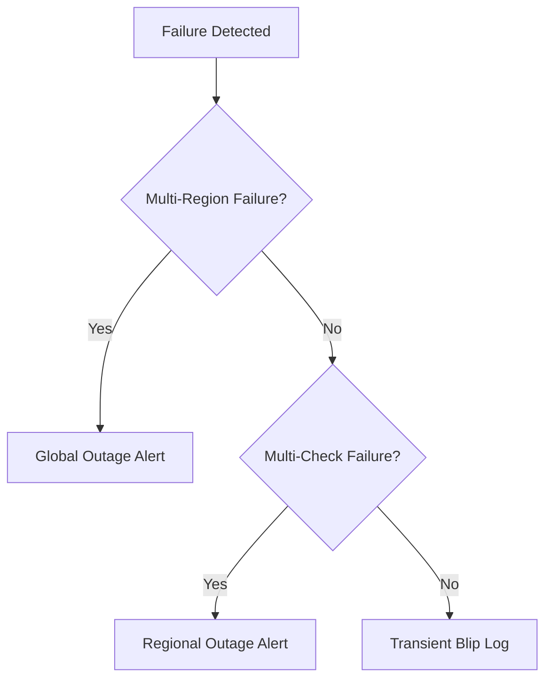
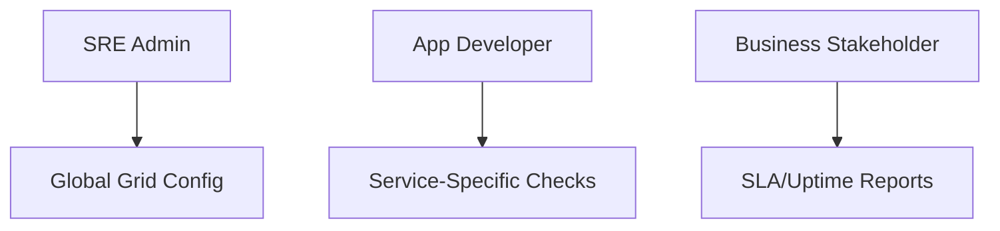
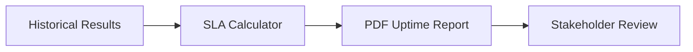
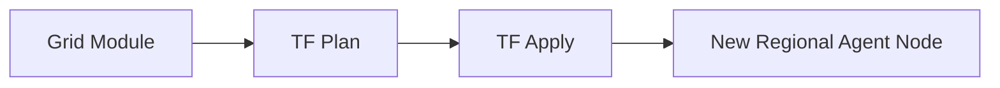

<div align="center">


<h1>Synthetic Monitoring Grid</h1>

<p><strong>The Strategic Observability Plane for Global Availability Simulation, Distributed Performance Intelligence, and Proactive Reliability Governance.</strong></p>

[]()
[]()
[]()

<br/>

> **"Be the first to know when your services fail."** 
> **Synthetic Monitoring Grid (Synth-Grid)** is an institutional-grade platform designed to provide a secure, measurable, and highly automated foundation for global proactive observability. It orchestrates the entire lifecycle of availability simulation—from distributed multi-region HTTP/API checks to user journey scripting and incident correlation.

</div>

---

## 🏛️ Executive Summary

Reactive monitoring is a liability; proactive simulation is a strategic necessity. Organizations often fail to meet reliability targets not because of a lack of telemetry, but because of fragmented check execution and an inability to detect user-impacting failures before users report them.

This platform provides the **Synthetic Observability Plane**. It implements a complete **Proactive Reliability Framework**, enabling SRE teams to manage availability checks as versioned, code-driven modules. By automating regional probing and performance aggregation, we ensure that global service health is continuously simulated and governed according to five-nines standards.

---

## 📐 Architecture Storytelling: Principal Reference Models

### 1. Principal Architecture: Global Synthetic Performance Intelligence Plane
This diagram illustrates the end-to-end flow from check definition to global regional execution and incident orchestration.

```mermaid
graph LR
    %% Subgraph Definitions
    subgraph ControlPlane["Global Control Plane (Command Center)"]
        direction TB
        UI["React Grid Dashboard"]
        API["FastAPI Orchestrator"]
        Sched["Distributed Scheduler"]
        State["State Store (PostgreSQL/Redis)"]
    end

    subgraph ExecutionGrid["Global Execution Grid (Probe Nodes)"]
        direction TB
        NodeUS["US-East Agent (AWS)"]
        NodeEU["EU-West Agent (Azure)"]
        NodeAsia["Asia-NE Agent (GCP)"]
        NodeEdge["Edge Probe (Akamai/Cloudflare)"]
    end

    subgraph TargetEcosystem["Monitored Service Ecosystem"]
        direction TB
        Web["Public Web Apps"]
        ServiceAPI["Core Service APIs"]
        Legacy["Internal Legacy Endpoints"]
    end

    subgraph Intelligence["Observability & Alerting Intelligence"]
        direction TB
        Corr["Regional Outage Correlator"]
        SLA["SLA/SLO Compliance Engine"]
        Alert["PagerDuty / Slack Integration"]
    end

    subgraph DevOps["Monitoring-as-Code Orchestration"]
        direction TB
        GH["GitHub Actions (Checks-as-Code)"]
        TF["Terraform Grid Modules"]
        Prom["Prometheus / Grafana Sinks"]
    end

    %% Flow Arrows
    Sched -->|1. Dispatch Tasks| ExecutionGrid
    ExecutionGrid -->|2. Probe| TargetEcosystem
    TargetEcosystem -->|3. Response| ExecutionGrid
    ExecutionGrid -->|4. Report Results| API
    
    API -->|5. Store| State
    API -->|6. Analyze| Corr
    Corr -->|7. Correlate Failures| Alert
    Corr -->|8. Score| SLA
    
    GH -->|9. Define Checks| API
    TF -->|10. Provision Agents| ExecutionGrid
    API -->|Telemetery| Prom

    %% Styling
    classDef control fill:#f5f5f5,stroke:#616161,stroke-width:2px;
    classDef grid fill:#ede7f6,stroke:#311b92,stroke-width:2px;
    classDef target fill:#e8f5e9,stroke:#1b5e20,stroke-width:2px;
    classDef intel fill:#fce4ec,stroke:#880e4f,stroke-width:2px;
    classDef devops fill:#fffde7,stroke:#f57f17,stroke-width:2px;

    class ControlPlane control;
    class ExecutionGrid grid;
    class TargetEcosystem target;
    class Intelligence intel;
    class DevOps devops;
```



### 2. The Synthetic Probe Lifecycle: Schedule to Result
The automated steps taken for every individual check in the grid.



### 3. Multi-Protocol Probing Engine
Executing diverse check types across the global fleet.



### 4. Alerting & Incident Orchestration Flow
Converting technical failures into actionable business alerts.



### 5. Performance Waterfall Analysis: Deep Dive
Deconstructing the response time of a single synthetic request.



### 6. Synthetic-to-RUM Correlation
Mapping proactive probe data against real user experience metrics.



### 7. Regional Outage Correlation Logic
Identifying when a failure is a regional cloud issue vs. an application bug.



### 8. Identity & Access for Monitoring Ops: RBAC
Who can manage the global monitoring schedules and alert rules.



### 9. Compliance & SLA Reporting Hub
Generating evidence of service availability for institutional stakeholders.



### 10. IaC Deployment: Monitoring-as-Code
Scaling the execution grid across new regions using Terraform.



---

## 🏛️ Core Platform Pillars

1.  **Distributed Execution Grid**: Centralized hub for dispatching synthetic checks to agents across multiple global regions.
2.  **Multi-Step Synthetic Scripting**: Powerful engine for simulating complex user journeys and multi-step API flows.
3.  **Real-time Performance Aggregation**: Intelligent capture and storage of latency, success rates, and response headers.
4.  **Proactive Incident Correlation**: Automated analysis of failure patterns to distinguish between transient blips and regional outages.
5.  **Policy-Driven Alerting Engine**: Rule-based evaluation of results against multi-tiered thresholds and SLA commitments.
6.  **Unified Reliability Dashboard**: Deep monitoring of global uptime, latency heatmaps, and grid health.

---

## 🛠️ Technical Stack & Implementation

### Platform Engine & APIs
*   **Framework**: Python 3.11+ / FastAPI.
*   **Check Runner**: Multi-protocol execution engine supporting HTTP, DNS, TCP, and ICMP.
*   **Scheduler**: High-precision distributed cron for frequency-based execution.
*   **State Management**: PostgreSQL for check definitions and Redis for task queues.
*   **Observability**: Integrated with Prometheus for agent health and Grafana for trend analysis.

### Frontend (Monitoring Command Center)
*   **Framework**: React 18 / Vite.
*   **Theme**: Rose / Slate (Modern Observability & SRE aesthetic).
*   **Visualization**: Recharts for latency waterfals and regional health matrices.

### Infrastructure & DevOps
*   **Runtime**: AWS EKS or Azure Kubernetes Service (AKS).
*   **IaC**: Modular Terraform for scaling regional agent nodes.

---

## 🏗️ IaC Mapping (Module Structure)

| Module | Purpose | Real Services |
| :--- | :--- | :--- |
| **`infrastructure/control`** | The management plane | EKS, PostgreSQL, Redis |
| **`infrastructure/agents`** | Regional probe nodes | EC2, Fargate, ACI |
| **`infrastructure/alerting`** | Notification orchestration | SNS, PagerDuty, Webhooks |
| **`infrastructure/metrics`** | Observability sinks | Managed Prometheus, Grafana |

---

## 🚀 Deployment Guide

### Local Principal Environment
```bash
# Clone the monitoring grid
git clone https://github.com/devopstrio/synthetic-monitoring-grid.git
cd synthetic-monitoring-grid

# Configure environment
cp .env.example .env

# Launch the Synthetic stack
make up

# Trigger a manual probe execution
make run-checks

# Start the distributed scheduler
make schedule-checks
```

Access the Monitoring Grid Dashboard at `http://localhost:3000`.

---

## 📜 License
Distributed under the MIT License. See `LICENSE` for more information.

---
<div align="center">
  <p>© 2026 Devopstrio. All rights reserved.</p>
</div>
