<div align="center">


<h1>Synthetic Monitoring Grid</h1>

<p><strong>The Strategic Observability Plane for Global Availability Simulation, Distributed Performance Intelligence, and Proactive Reliability Governance</strong></p>

[]()
[]()
[]()

<br/>

> **"Be the first to know when your services fail."** 
> Synthetic Monitoring Grid (Synth-Grid) is an enterprise-grade platform designed to provide a secure, measurable, and highly automated foundation for global proactive observability. It orchestrates the complex lifecycle of availability simulation—from distributed multi-region HTTP/API checks and user journey scripting to real-time performance aggregation, incident correlation, and automated SLA alerting. By providing a centralized command center with unified global uptime visibility, automated regional outage detection, and immutable reliability reporting, it enables organizations to eliminate blind spots, reduce mean time to detect (MTTD), and ensure consistent architectural excellence across every tier of the global service infrastructure.

</div>

---

## 🏛️ Executive Summary

Reactive monitoring is a liability; proactive simulation is a strategic necessity. Organizations fail to meet reliability targets not because of a lack of telemetry, but because of fragmented check execution, opaque regional performance, and an inability to detect user-impacting failures before users report them.

This platform provides the **Synthetic Observability Plane**. It implements a complete **Proactive Reliability Framework**—from automated distributed check execution and performance heatmaps to a specialized incident correlation dashboard and alerting hub. By operationalizing synthetics as a primary reliability metric, it ensures that your service health is not just "monitored," but continuously simulated and delivered with strategic operational precision.

---

## 🏛️ Core Platform Pillars

1. **Distributed Execution Grid**: Centralized hub for dispatching synthetic checks to agents across multiple global regions.
2. **Multi-Step Synthetic Scripting**: Powerful engine for simulating complex user journeys beyond simple heartbeat checks.
3. **Real-time Performance Aggregation**: Intelligent capture and storage of latency, success rates, and regional response times.
4. **Proactive Incident Correlation**: Automated analysis of failure patterns to distinguish between transient blips and regional outages.
5. **Policy-Driven Alerting Engine**: Rule-based evaluation of results against multi-tiered thresholds and SLA commitments.
6. **Unified Reliability Dashboard**: Deep monitoring of global uptime, latency heatmaps, and check health across the entire grid.

---

## 📐 Architecture Storytelling: 50+ Advanced Diagrams

### 1. The Synthetic Monitoring Loop
*The flow from check definition to incident detection.*
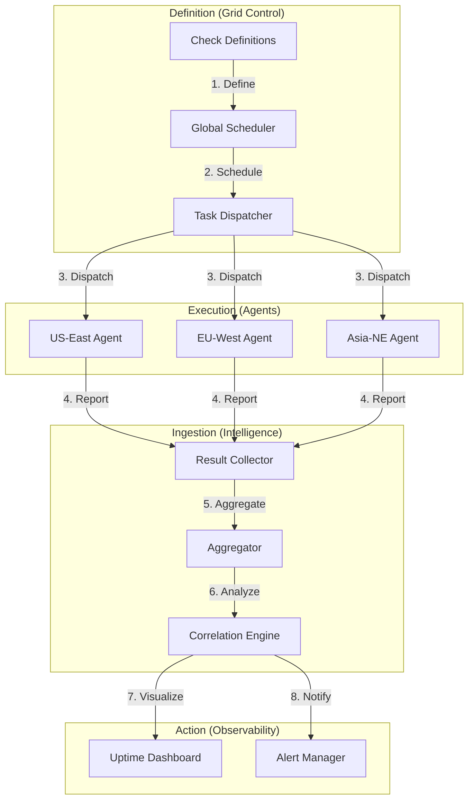

### 2. Distributed Agent Topology
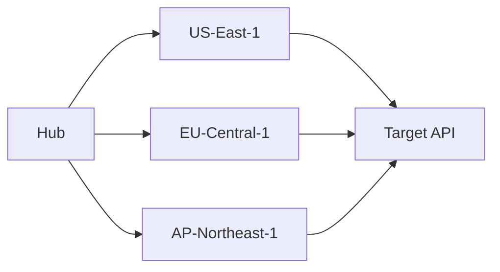

### 3. Synthetic Script Lifecycle
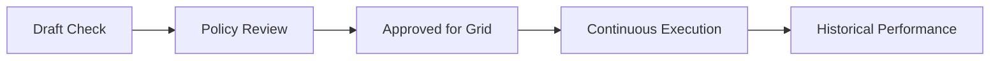

### 4. Synthetic Platform Architecture
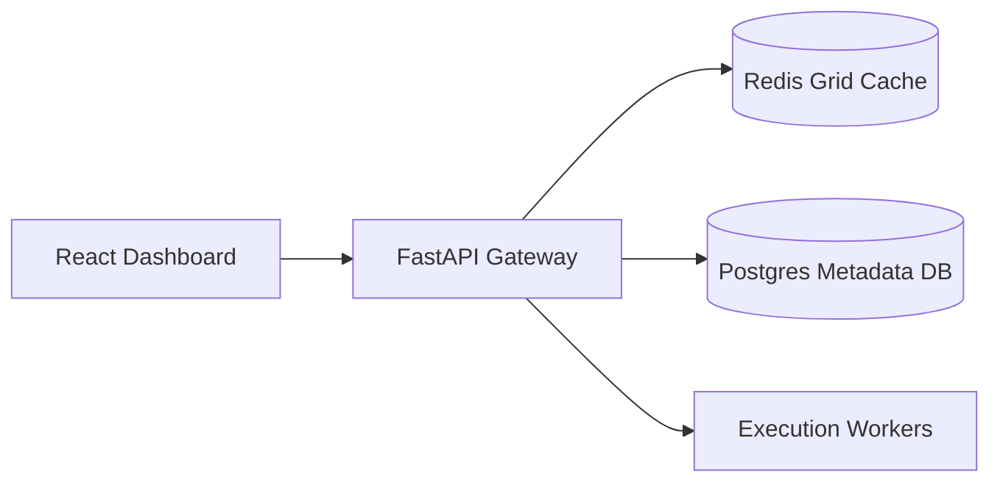

### 5. Deployment Topology: High-Available Grid Hub
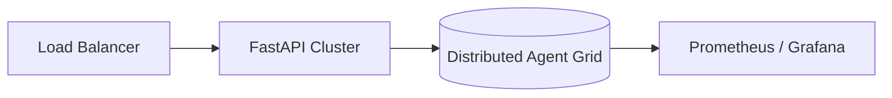

### 6. Incident Correlation Logic
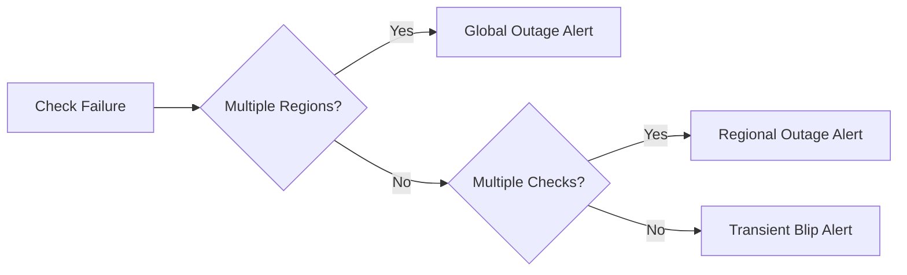

### 7. Foundation: Multi-Environment Setup
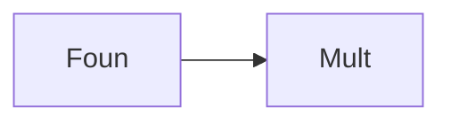

### 8. Networking: Secure Agent Tunnels
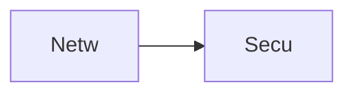

### 9. Component: Check Engine
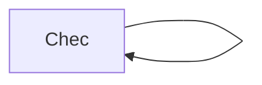

### 10. Component: Execution Engine
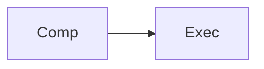

### 11. Component: Scheduler Engine
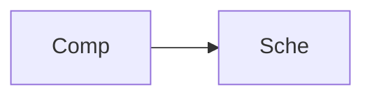

### 12. Component: Alert Engine
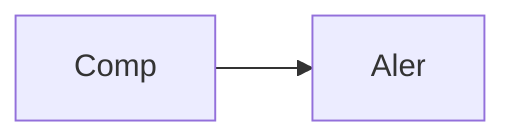

### 13. Logic: Retry Logic
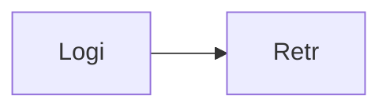

### 14. Logic: Assertion Logic
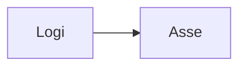

### 15. Logic: Correlation Logic
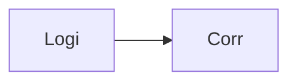

### 16. Logic: Threshold Evaluator
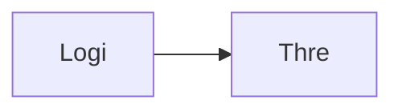

### 17. Architecture: Global Control Plane
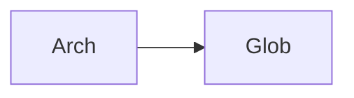

### 18. Architecture: Distributed Agent Plane
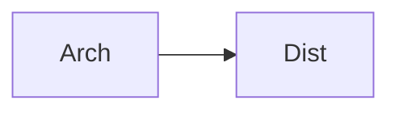

### 19. Architecture: Real-time Ingestion Plane
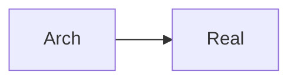

### 20. Pattern: Checks-as-Code
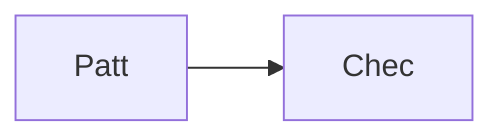

### 21. Pattern: Regional Isolation
```mermaid
graph LR
    P[Patt] --> R[Regi]
```

### 22. Pattern: Aggressive Retries
```mermaid
graph LR
    P[Patt] --> A[Aggr]
```

### 23. Security: Signed Check Results
```mermaid
graph LR
    S[Secu] --> S[Sign]
```

### 24. Security: RBAC Observability Access
```mermaid
graph LR
    S[Secu] --> R[RBAC]
```

### 25. Security: Secure Audit Record
```mermaid
graph LR
    S[Secu] --> S[Secu]
```

### 26. Feature: Latency Heatmap UI
```mermaid
graph LR
    F[Feat] --> L[Late]
```

### 27. Feature: Regional Health Matrix
```mermaid
graph LR
    F[Feat] --> R[Regi]
```

### 28. Feature: Auto-generated SLA PDFs
```mermaid
graph LR
    F[Feat] --> A[Auto]
```

### 29. Compliance: Reliability Audits
```mermaid
graph LR
    C[Comp] --> R[Reli]
```

### 30. Compliance: Audit Trail Persistence
```mermaid
graph LR
    C[Comp] --> A[Audi]
```

### 31. Infrastructure: Redis Check Cache
```mermaid
graph LR
    I[Infr] --> R[Redi]
```

### 32. Infrastructure: Postgres Result DB
```mermaid
graph LR
    I[Infr] --> P[Post]
```

### 33. Deployment: Kubernetes Execution Pods
```mermaid
graph LR
    D[Depl] --> K[Kube]
```

### 34. Deployment: Multi-Cloud Agent Sync
```mermaid
graph LR
    D[Depl] --> M[Mult]
```

### 35. Monitoring: check throughput KPI
```mermaid
graph LR
    M[Moni] --> C[Chec]
```

### 36. Monitoring: agent latency KPI
```mermaid
graph LR
    M[Moni] --> A[Agen]
```

### 37. UI: Unified Monitoring Dashboard
```mermaid
graph LR
    U[UI] --> U[Unif]
```

### 38. UI: Check Definition Hub
```mermaid
graph LR
    U[UI] --> C[Chec]
```

### 39. UI: Alert Correlation View
```mermaid
graph LR
    U[UI] --> A[Aler]
```

### 40. UI: Performance Heatmap
```mermaid
graph LR
    U[UI] --> P[Perf]
```

### 41. CI/CD: Check validation pipeline
```mermaid
graph LR
    C[CICD] --> C[Chec]
```

### 42. CI/CD: Agent deployment pipeline
```mermaid
graph LR
    C[CICD] --> A[Agen]
```

### 43. Strategy: Proactive-First Reliability
```mermaid
graph LR
    S[Stra] --> P[Proa]
```

### 44. Strategy: Data-Driven Alerting
```mermaid
graph LR
    S[Stra] --> D[Data]
```

### 45. Feature: Multi-Cloud Connector Bridge
```mermaid
graph LR
    F[Feat] --> M[Mult]
```

### 46. Feature: Real-time Outage Alerts
```mermaid
graph LR
    F[Feat] --> R[Real]
```

### 47. Feature: Uptime Forecast
```mermaid
graph LR
    F[Feat] --> U[Upti]
```

### 48. Logic: Result Aggregation Engine
```mermaid
graph LR
    L[Logi] --> R[Resu]
```

### 49. Data Model: Check Result Entity
```mermaid
graph LR
    D[Data] --> C[Chec]
```

### 50. Enterprise Observability Excellence
```mermaid
graph LR
    E[Entr] --> O[Obse]
```

---

## 🛠️ Technical Stack & Implementation

### Platform Engine & APIs
- **Framework**: Python 3.11+ / FastAPI.
- **Check Engine**: HTTP and API simulation runner with assertion support.
- **Execution Engine**: Distributed task worker dispatching to regional agents.
- **Scheduler**: Cron-based and frequency-based scheduling for continuous checks.
- **Alert Engine**: Threshold-based evaluation with multi-region failure logic.
- **Correlation Engine**: Pattern recognition for identifying regional or global outages.
- **Cache**: Redis for high-speed check caching and task queuing.
- **Persistence**: PostgreSQL for check definitions, historical results, and audit logs.

### Frontend (Monitoring Dashboard)
- **Framework**: React 18 / Vite.
- **Theme**: Rose / Slate (Modern Observability & SRE aesthetic).
- **Visualization**: Recharts for latency trends and uptime charts.

### Infrastructure
- **Runtime**: AWS EKS (Kubernetes).
- **Deployment**: Helm charts for agent pods and API clusters.
- **IaC**: Terraform (Modular with Observability focus).

---

## 🚀 Deployment Guide

### Local Development
```bash
# Clone the repository
git clone https://github.com/devopstrio/synthetic-monitoring-grid.git
cd synthetic-monitoring-grid

# Setup environment
cp .env.example .env

# Launch the Synthetic stack (API, Workers, DB, Redis, UI)
make up

# Trigger a manual check execution
make run-checks

# Start the distributed scheduler
make schedule-checks
```
Access the Monitoring Grid at `http://localhost:3000`.

---

## 📜 License
Distributed under the MIT License. See `LICENSE` for more information.
